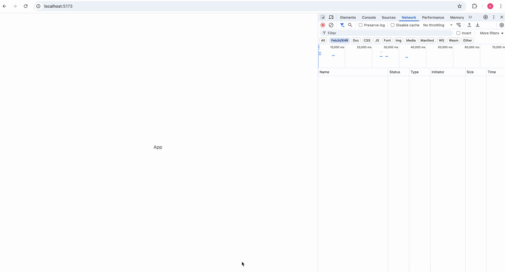
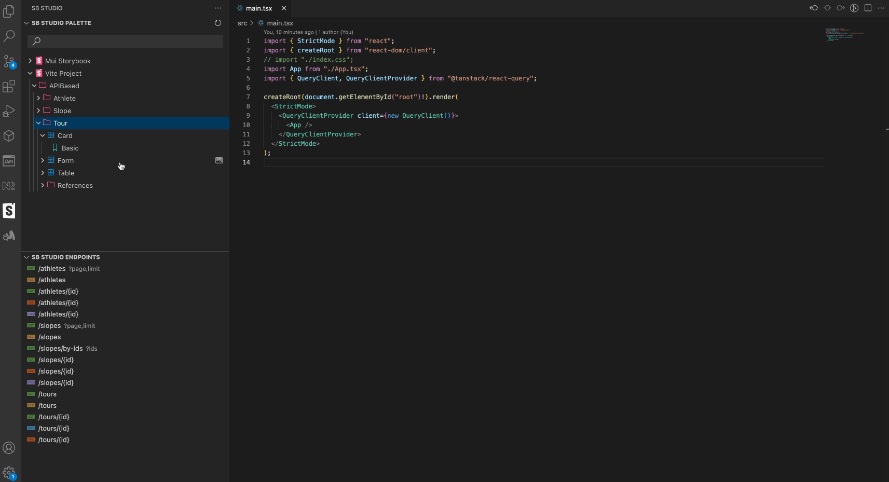

# Storybook Studio Start App

This is a small React application demonstrating Storybook Studio features.

## Steps

1. Install [Storybook Studio](https://marketplace.visualstudio.com/items?itemName=haulmont-tech-ltd.storybook-studio) from the official Visual Studio Marketplace.  
2. Open **Storybook Studio** from the Activity Bar (click on the brush icon or press `CTRL+A CTRL+P`), then click **Install Dependencies**. After that, click **Install MUI Storybook and Init Local Storybook**.  
3. Once initialized, you can start using the **Storybook Palette** with preview and drag-and-drop (DnD) support.  
4. Start creating your app by dragging `AdminLayout` into the `Layout` component in `App.tsx`.  
   
5. Go to **Storybook Studio** and click **Create Stories Based on API**. It will generate stories based on your API model locally. You can view them in the Storybook Studio Palette and use drag-and-drop to insert components based on them.  
     
   
6. If you need to bind your view to data, try dragging an endpoint from **Storybook Studio Endpoints** into your component.  
7. Use the **Storybook Studio Inspector** to quickly create event handlers and modify properties.  
   